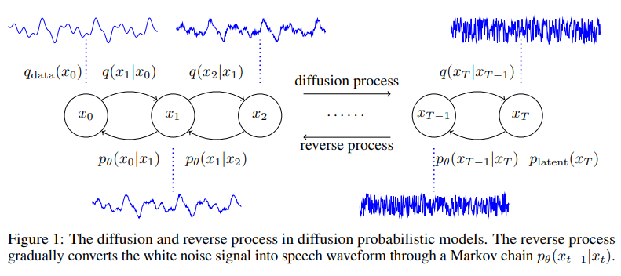
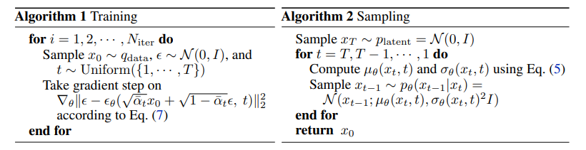
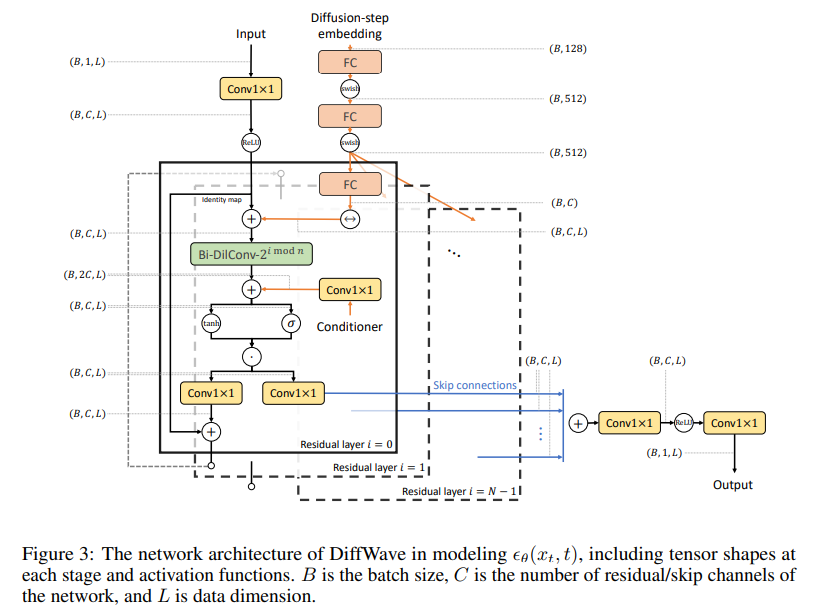

# DiffWave
Official Paper: https://arxiv.org/pdf/2009.09761

## Introduction
DiffWave, a versatile diffusion probabilistic model for conditional and unconditional waveform generation. The model is non-autoregressive, and converts the white noise signal into structured waveform through a Markov chain with a constant number of steps at synthesis. It is efficiently trained by optimizing a variant of variational bound on the data likelihood. DiffWave produces high-fidelity audio in different waveform generation tasks, including neural vocoding conditioned on mel spectrogram, class-conditional generation, and unconditional generation. We demonstrate that DiffWave matches a strong WaveNet vocoder in terms of speech quality (MOS: 4.44 versus 4.43), while synthesizing orders of magnitude faster. In particular, it significantly outperforms autoregressive and GAN-based waveform models in the challenging unconditional generation task in terms of audio quality and sample diversity from various automatic and human evaluations.

## Method 

## Architecture
