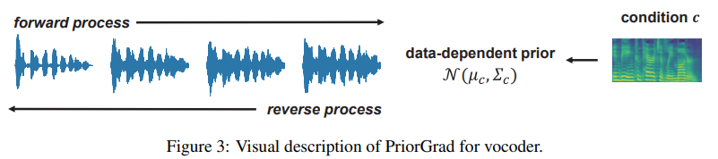
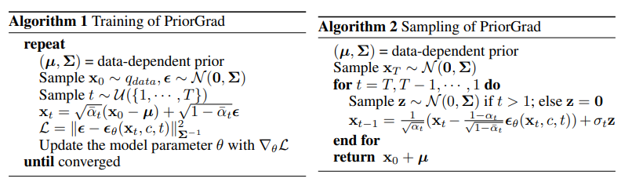

# PriorGrad 
Offical Paper: https://arxiv.org/pdf/2106.06406

## Introduction 
Denoising diffusion probabilistic models have been recently proposed to generate high-quality samples by estimating the gradient of the data density. The framework defines the prior noise as a standard Gaussian distribution, whereas the corresponding data distribution may be more complicated than the standard Gaussian distribution, which potentially introduces inefficiency in denoising the prior noise into the data sample because of the discrepancy between the data and the prior. In this paper, PriorGrad is proposed to improve the efficiency of the conditional diffusion model for speech synthesis (for example, a vocoder using a mel-spectrogram as the condition) by applying an adaptive prior derived from the data statistics based on the conditional information. 

## Method
