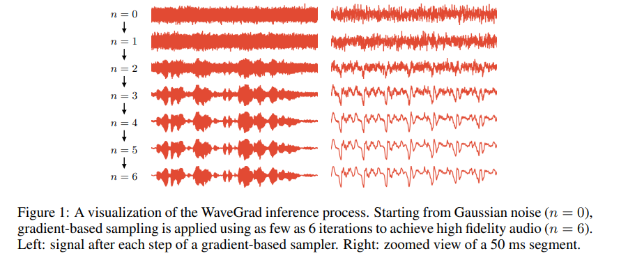
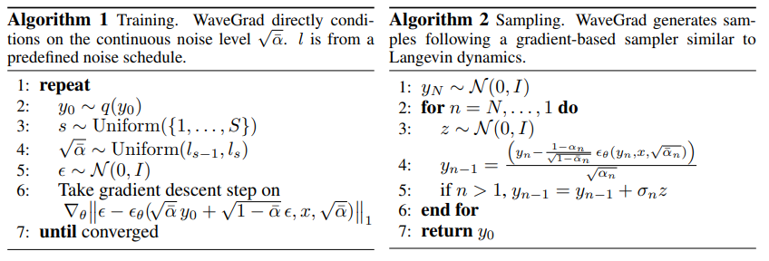
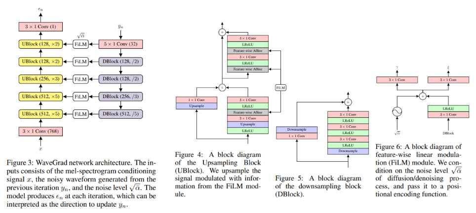

# WaveGrad 
Official Paper: https://arxiv.org/pdf/2009.00713

## Introduction
WaveGrad is a conditional model for waveform generation which estimates gradients of the data density. It starts from a Gaussian white noise signal and iteratively refines the signal via a gradient-based sampler conditioned on the mel-spectrogram. The model can generate high fidelity audio samples using as few as six iterations.

## Method

## Architecture
To convert the mel-spectrogram signal (80 Hz) into raw audio (24 kHz), five upsampling blocks (UBlock) are applied to gradually upsample the temporal dimension by factors of 5, 5, 3, 2, 2, with the number of channels of 512, 512, 256, 128, 128 respectively. Additionally, one convolutional layer is added before and after these blocks. 

Each UBlock includes two residual blocks. The dilation factors of four convolutional layers are 1, 2, 4, 8 for the first three UBlocks and 1, 2, 1, 2 for the rest. Upsampling is carried out by repeating the nearest input. For the large model, we use 1, 2, 4, 8 for all UBlocks.

Downsampling blocks (DBlock) are introduced to downsample the temporal dimension of the noisy waveform. The DBlock is similar to UBlock except that only one residual block is included. The dilation factors are 1, 2, 4 in the main branch. Downsampling is carried out by convolution with strides. Orthogonal initialization is used for all UBlocks and DBlocks. 

The feature-wise linear modulation (FiLM) module combines information from both noisy waveform and input mel-spectrogram. We also represent the iteration index n, which indicates the noise level of the input waveform, using Transformer-style sinusoidal positional embeddings.

